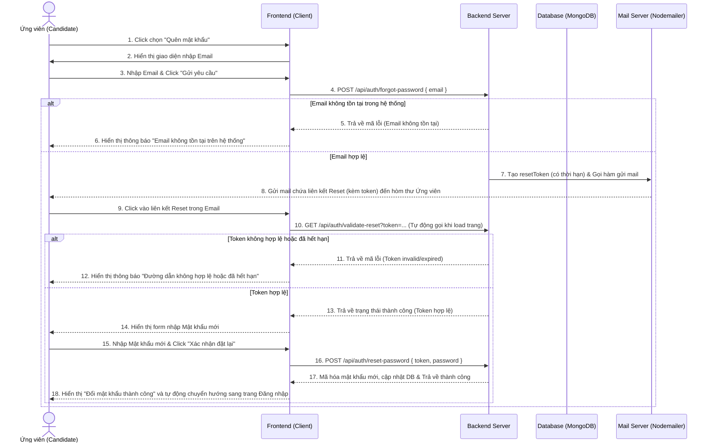
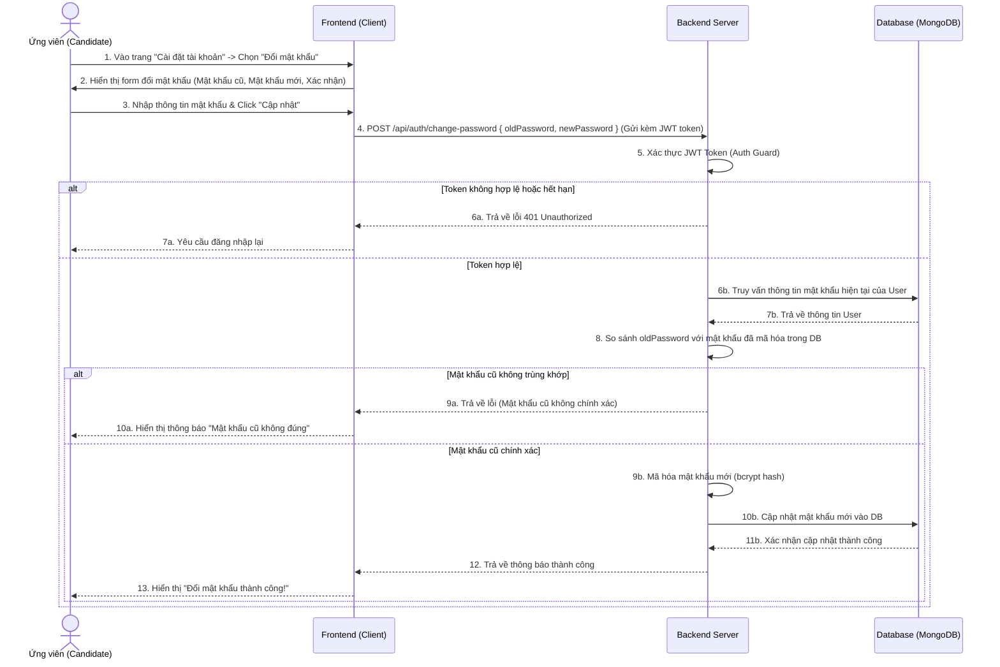
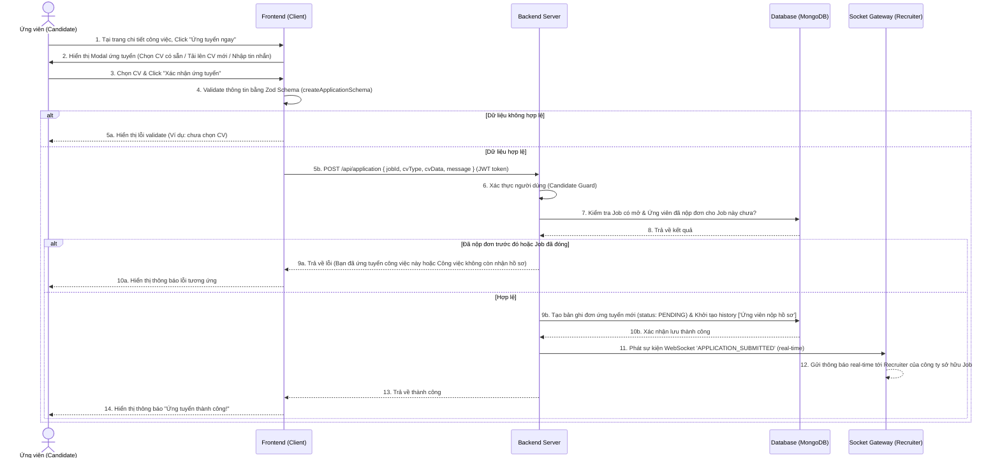
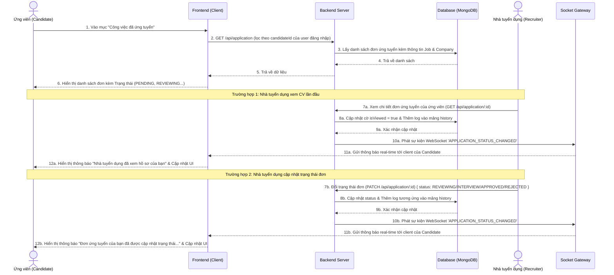
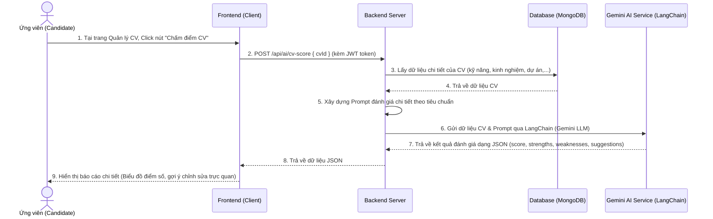
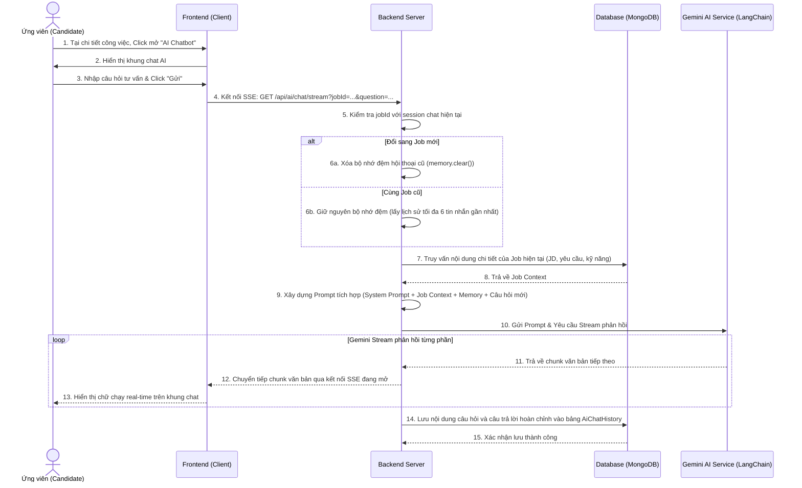
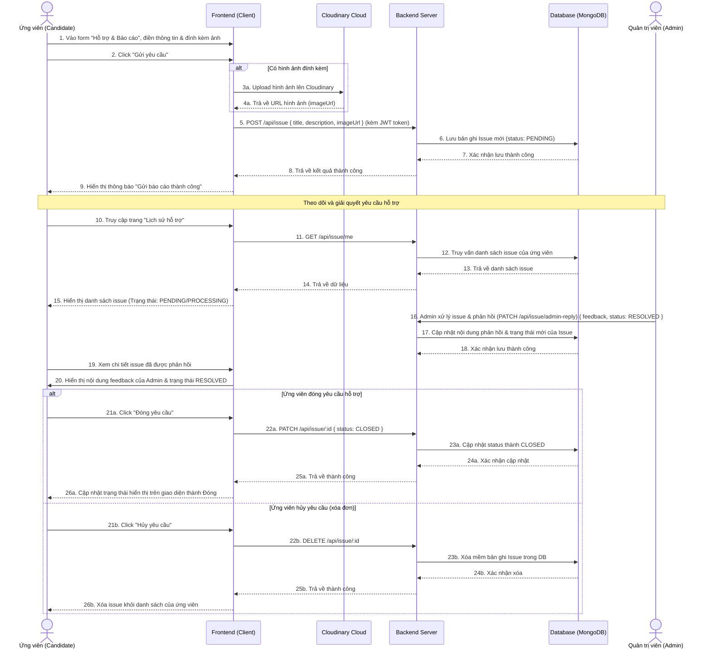

# Biểu đồ Tuần tự của Actor Candidate (Ứng viên)

Tài liệu này chứa các biểu đồ tuần tự (Sequence Diagrams) mô tả dòng tương tác trực tiếp theo thời gian giữa **Candidate (Ứng viên)**, **Frontend (Client)**, **Backend Server (NestJS)**, **Database (MongoDB)** và các thành phần liên quan khác trong hệ thống Next-Nest.

---

## 1. Nhóm chức năng: Quản lý Tài khoản & Xác thực (Auth)

### A. Luồng Quên mật khẩu (Forgot Password)

---

### B. Luồng Đổi mật khẩu (Change Password - Đang đăng nhập)

---

## 2. Nhóm chức năng: Ứng tuyển & Theo dõi đơn ứng tuyển

### A. Luồng Nộp hồ sơ ứng tuyển (Apply Job)

### B. Luồng Theo dõi đơn ứng tuyển (Application Tracking)

---

## 3. Nhóm chức năng: Tương tác AI (AI Features)

### A. Luồng Chấm điểm chất lượng CV (AI CV Score)

### B. Luồng Trò chuyện tư vấn công việc với AI (AI Chatbot Stream)

---

## 4. Nhóm chức năng: Hỗ trợ & Báo cáo (Issue)

