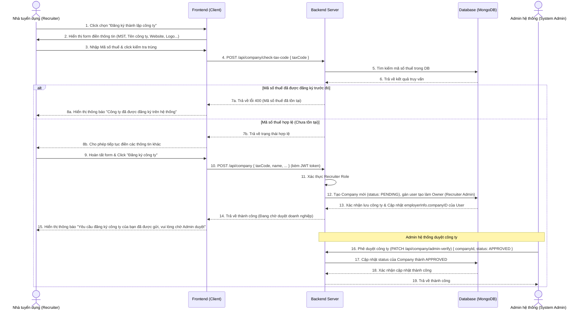
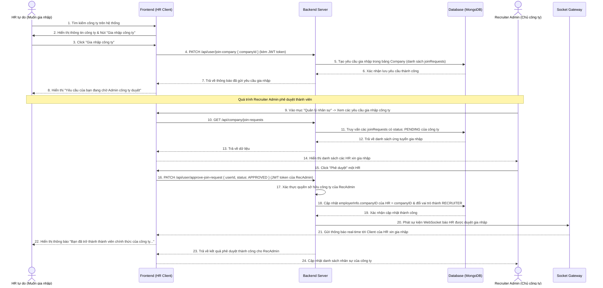
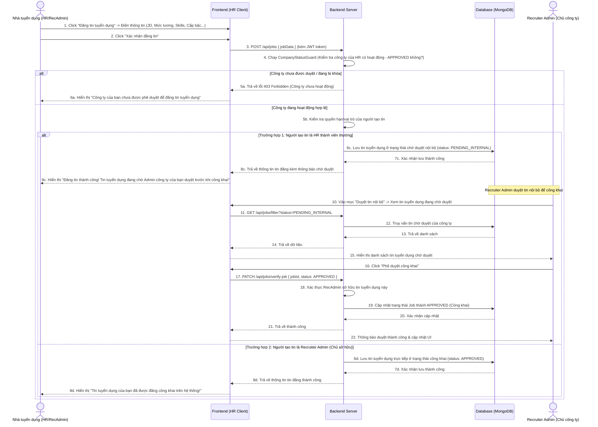
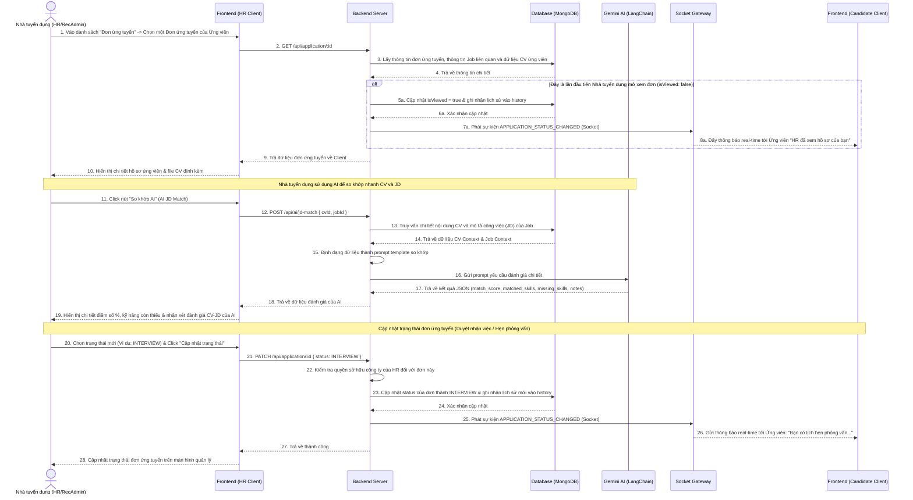
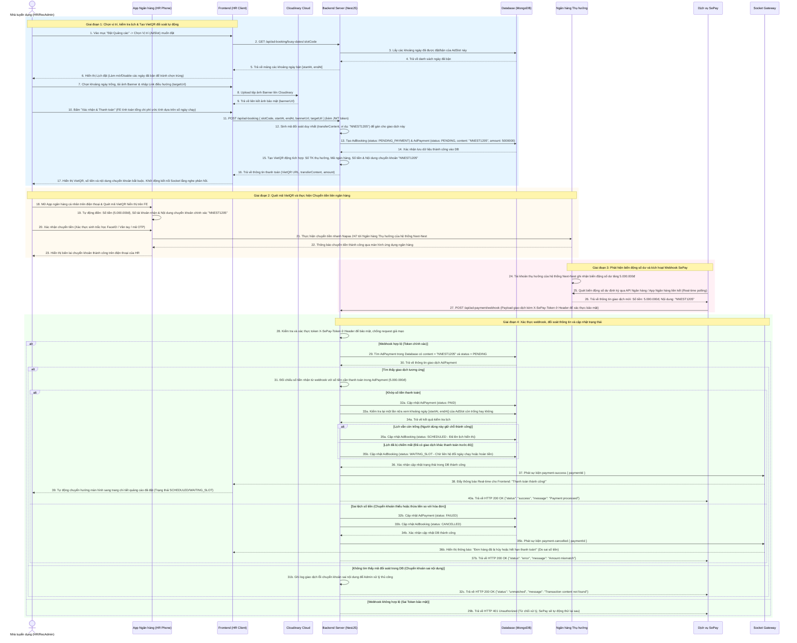

# Biểu đồ Tuần tự của Actor Recruiter / Recruiter Admin (Nhà tuyển dụng)

Tài liệu này chứa các biểu đồ tuần tự (Sequence Diagrams) mô tả dòng tương tác trực tiếp theo thời gian giữa **Recruiter / Recruiter Admin (Nhà tuyển dụng)**, **Frontend (Client)**, **Backend Server (NestJS)**, **Database (MongoDB)** và các thành phần liên quan khác trong hệ thống Next-Nest.

---

## 1. Nhóm chức năng: Quản lý Tài khoản & Đăng ký doanh nghiệp

Luồng này bao gồm hai sự lựa chọn liên kết doanh nghiệp: **Tạo mới công ty** (để trở thành Recruiter Admin) hoặc **Gia nhập công ty đã tồn tại** (trở thành HR thành viên).

### A. Luồng Đăng ký thành lập Công ty mới (Trở thành Recruiter Admin)

---

### B. Luồng Gia nhập công ty đã tồn tại (Trở thành Recruiter thành viên)

---

## 2. Nhóm chức năng: Quản lý Tin tuyển dụng (Job Management)

### Luồng Đăng tin tuyển dụng & Phê duyệt nội bộ

---

## 3. Nhóm chức năng: Quản lý Đơn ứng tuyển (Application Management)

### Luồng Xử lý Đơn ứng tuyển & So khớp hồ sơ bằng AI (AI JD Match)

---

## 4. Nhóm chức năng: Đặt Banner Quảng cáo (Advertising Booking)

### Luồng Đặt Quảng cáo & Thanh toán tự động qua Webhook ngân hàng

