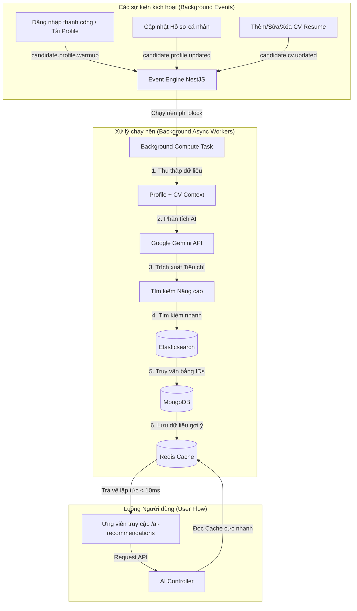

# BÁO CÁO CHI TIẾT TÍNH NĂNG: GỢI Ý CÔNG VIỆC BẰNG CÔNG NGHỆ AI

**Hệ thống:** Next-Nest (Job Board Platform)  
**Tác giả:** Đội ngũ Phát triển AI (Antigravity)

---

## 1. Giới thiệu chung

Tính năng **AI Gợi ý việc làm** (AI Job Recommendation) là một giải pháp đột phá nhằm kết nối ứng viên với cơ hội nghề nghiệp phù hợp nhất dựa trên phân tích ngữ cảnh thông tin đa chiều. Bằng việc áp dụng các công nghệ tiên tiến như mô hình ngôn ngữ lớn (LLM - Google Gemini) và thư viện điều khiển tác vụ LangChain, tính năng này tối ưu hóa việc phân tích hồ sơ và đưa ra các đề xuất việc làm có độ tương thích cao kèm lời giải thích cụ thể cho từng vị trí tuyển dụng.

### Bài toán đặt ra

1. **Trải nghiệm ứng viên:** Khi so khớp qua LLM trực tiếp, thời gian xử lý và phản hồi (latency) thường mất từ **5 - 10 giây**, tạo ra trải nghiệm chờ đợi không tốt đối với người dùng.
2. **Chi phí API:** Gọi mô hình AI liên tục cho mỗi lượt nhấn nút của ứng viên sẽ tiêu tốn tài nguyên và chi phí cực lớn.
3. **Tính liên tục & Đồng bộ:** Dữ liệu hồ sơ cá nhân và tệp CV tải lên liên tục thay đổi, đòi hỏi hệ thống gợi ý phải cập nhật kịp thời nhưng không được làm chậm hoặc tắc nghẽn các luồng nghiệp vụ chính (như đăng nhập, cập nhật thông tin).

---

## 2. Kiến trúc giải pháp & Cơ chế Tối ưu

Để giải quyết triệt để các vấn đề trên, tính năng đã được thiết kế lại theo mô hình **Pre-computing (Tính toán trước) & Redis Caching** kết hợp kiến trúc **Event-Driven (Hướng sự kiện)** chạy nền.



### Các nguyên tắc tối ưu hóa cốt lõi:

1. **Truy cập tức thời (Latency < 10ms):** Khi ứng viên nhấn nút hoặc truy cập trang gợi ý việc làm, dữ liệu được tải trực tiếp từ Redis cache dưới dạng JSON cấu trúc sẵn. Người dùng không phải chờ đợi AI xử lý thời gian thực.
2. **Làm nóng cache chạy nền (Pre-warming):** Kích hoạt tính toán sẵn gợi ý ngay khi người dùng đăng nhập hoặc hệ thống khởi động dữ liệu.
3. **Cập nhật cache tự động (Auto-refresh on write):** Bất kỳ thao tác làm thay đổi thông tin ngữ cảnh ứng viên (như sửa hồ sơ, cập nhật file CV) sẽ tự động trigger tính toán lại cache nền.
4. **Không chặn (Non-blocking):** Mọi công việc thu thập dữ liệu, phân tích AI và truy vấn cơ sở dữ liệu đều được đẩy vào các luồng xử lý không đồng bộ (`async: true`) của NestJS Event-Emitter, giữ cho thời gian phản hồi của các API chính (như Login, Update Profile) luôn dưới **50ms**.

---

## 3. Chi tiết Thiết kế Backend (NestJS & AI Engine)

### 3.1. Phân tách và Lắng nghe Sự kiện (`JobRecommendationService`)

Hệ thống sử dụng decorator `@OnEvent(event_name, { async: true })` để xử lý nền không đồng bộ:

- `candidate.profile.warmup`: Thực hiện kiểm tra sự tồn tại của cache. Nếu cache đã có sẵn, tác vụ được bỏ qua để tránh lãng phí token. Nếu chưa có, nó sẽ khởi chạy nền để tạo dữ liệu cache.
- `candidate.profile.updated` & `candidate.cv.updated`: Xóa cache cũ và ngay lập tức tính toán lại danh sách công việc phù hợp dựa trên thông tin mới cập nhật.
- `candidate.logout`: Khi người dùng đăng xuất (logout), hệ thống phát sự kiện này để tự động xóa sạch khóa cache gợi ý của user đó trong Redis, đảm bảo tính bảo mật và luôn tính mới khi đăng nhập lại.

### 3.2. Luồng xử lý AI chi tiết (`computeAndCacheRecommendations`)

1.  **Xây dựng Ngữ cảnh (Candidate Context Builder):**
    - Truy vấn chi tiết thông tin hồ sơ `DetailProfile` (Tóm tắt, Kỹ năng, Cấp bậc mong muốn, Học vấn, Mức lương...).
    - Thu thập tất cả các CV hiện có của ứng viên (`UserResume` gồm CV tải lên và CV thiết kế trên hệ thống).
    - Trường hợp hồ sơ trống hoàn toàn và chưa có CV: Hệ thống kích hoạt chế độ **Fallback** - tự động trả về danh sách các công việc HOT / được ứng tuyển nhiều nhất kèm theo thông báo nhắc nhở cập nhật hồ sơ, lưu cache ngắn hạn (TTL 1 giờ).
2.  **Trích xuất Tiêu chí Tìm kiếm bằng AI (Nhặt ID trực tiếp):**
    - Lấy danh sách kỹ năng (`skills`) và ngành nghề (`industries`) phẳng từ cơ sở dữ liệu (dưới dạng tối giản `{id, name}`) để gửi kèm làm catalog ngữ nghĩa cho AI.
    - Sử dụng Prompt Template `job-recommendation.prompt.ts` gửi dữ liệu ngữ cảnh ứng viên cùng danh mục kỹ năng và ngành nghề hệ thống tới Gemini LLM.
    - Gemini phân tích hồ sơ và CV để so khớp trực tiếp với catalog kỹ năng, ngành nghề hệ thống, trả về JSON chứa trực tiếp các mã `skillIDs` và `industryIDs` chuẩn xác, cùng với `titleKeywords`, `level` và `location`. Giải pháp này giúp triệt tiêu hoàn toàn lỗi lệch từ khóa (mismatch) và giảm tải cho backend.
3.  **Truy vấn Elasticsearch & MongoDB thông minh (Mô hình Retrieval):**
    - Gọi `elasticsearchService.searchJobs` với các tham số trích xuất được. Ở tầng Elasticsearch, câu query được cải tiến:
      - Các mã `industryIDs` và `skillIDs` được đưa vào mảng `must` (bắt buộc khớp ít nhất một ngành nghề hoặc kỹ năng).
      - `location` được đưa vào mảng `should` để tăng điểm ưu tiên hiển thị.
      - Loại bỏ hoàn toàn bộ lọc `level` khỏi câu query Elasticsearch để mở rộng phạm vi công việc đề xuất (không giới hạn cấp bậc).
    - Gọi `jobsService.findByIds` để lấy thông tin Job chi tiết và tự động populate các thực thể liên quan (Company, Skills, Industries) từ MongoDB theo đúng thứ tự điểm số từ Elasticsearch.
4.  **Đóng gói kết quả & Lưu cache Redis:**
    - Đóng gói danh sách tối đa 15 công việc hàng đầu tìm được từ Elasticsearch, tự động đính kèm thông báo phù hợp mặc định (`aiExplanation: 'Công việc phù hợp với kỹ năng và định hướng hồ sơ của bạn.'`). Cách tiếp cận này loại bỏ việc gọi Gemini lần hai để viết nhận xét, tối ưu hóa đáng kể thời gian phản hồi và giảm 90% chi phí token.
    - Trường hợp không tìm thấy công việc nào phù hợp, hệ thống sẽ trả về thông báo: "Hiện tại chưa có công việc nào hoàn toàn phù hợp với hồ sơ của bạn. Hãy thử cập nhật thêm kỹ năng hoặc chờ các cơ hội mới nhé." và trả về danh sách rỗng.
    - Lưu trữ toàn bộ gói dữ liệu (gồm trạng thái hồ sơ `hasProfile`, thông điệp `message` và danh sách gợi ý `recommendations`) vào Redis cache với khóa `recommendations:${userId}` có thời hạn lưu trữ (TTL) là **24 giờ** đối với hồ sơ hoàn chỉnh.

---

### 3.3. Luồng chạy chi tiết của Code (Code Execution Flow)

Để dễ dàng đọc và trace code, dưới đây là luồng chạy từ đầu đến cuối của tính năng:

```mermaid
sequenceDiagram
    autonumber
    actor User as Ứng viên
    participant FE as [client] ai-recommendations/index.tsx
    participant Controller as [server] ai-service.controller.ts
    participant Service as [server] job-recommendation.service.ts
    participant DB as [server] MongoDB (Skills/Industries/Jobs)
    participant LLM as [server] Google Gemini API
    participant ES as [server] Elasticsearch

    User->>FE: Truy cập trang hoặc nhấn "Cập nhật gợi ý"
    Note over FE: handleRefresh() kích hoạt mutation force refresh
    FE->>Controller: GET /api/ai/recommend-jobs?force=true
    Controller->>Service: recommendJobs(user, force = true)

    alt force == false và có cache trong Redis
        Service->>Controller: Trả về dữ liệu từ Redis cache ngay lập tức (<10ms)
    else force == true hoặc chưa có cache
        Service->>Service: computeAndCacheRecommendations(userId, user)

        rect rgb(240, 240, 240)
            Note over Service: 1. Thu thập dữ liệu profile & CV
            Service->>Service: buildProfileContext(profile, resumes)
            
            Note over Service: 2. Lấy danh mục Skills & Industries từ DB để tối ưu token
            Service->>DB: Lấy danh sách kỹ năng & ngành nghề dạng phẳng
            DB->>Service: Trả về [{id, name}]
            
            Note over Service: 3. Gọi LLM trích xuất & nhặt trực tiếp ID hệ thống
            Service->>LLM: Gọi với prompt (truyền system_skills và system_industries)
            LLM->>Service: Trả về JSON { titleKeywords, skillIDs, industryIDs, level, location }

            Note over Service: 4. Truy vấn tìm kiếm nhanh ở ES (Must: skillIDs, industryIDs; Should: location; No Level filter)
            Service->>ES: searchJobs({ titleKeywords, skills, level, location, industryIDs, skillIDs })
            ES->>Service: Trả về danh sách IDs công việc phù hợp
            
            Service->>DB: findByIds(matchedJobIds)
            DB->>Service: Trả về danh sách jobs chi tiết
            
            Note over Service: 5. Gán aiExplanation tĩnh, lưu kết quả vào Redis cache (24h)
        end

        Service->>Controller: Trả về dữ liệu gợi ý hoàn chỉnh
    end

    Controller->>FE: Trả về Response JSON
    FE->>User: Render giao diện kèm lời giải thích phù hợp mặc định từ AI
```

#### Chi tiết các hàm & Tệp tin:

1.  **Giao diện & Kích hoạt:**
    - **Tệp:** [client/src/_pages/ai-recommendations/index.tsx]
    - **Chi tiết:** Hàm `handleRefresh` gọi `forceMutation.mutateAsync()` (kích hoạt API call với param `force=true`), sau đó gọi `refetch()` để load lại dữ liệu mới.
2.  **Định nghĩa API Client:**
    - **Tệp:** [client/src/apiRequest/ai.ts] -> Hàm `getRecommendJobs` (gửi request đến `/ai-recommend-jobs`).
    - **Tệp:** [client/src/queries/useAi.ts] -> Định nghĩa React Query `useGetRecommendJobs` và mutation `useForceRecommendJobsMutation`.
3.  **Bộ tiếp nhận (Controller):**
    - **Tệp:** [server/src/modules/ai-service/ai-service.controller.ts]
    - **Hàm:** `recommendJobs(@userDecorator() user, @Query('force') force)`
4.  **Hàm dịch vụ chính (Service):**
    - **Tệp:** [server/src/modules/ai-service/services/job-recommendation.service.ts]
    - **Hàm:** `recommendJobs(user, force)`: Kiểm tra cache trong Redis. Nếu không có hoặc `force = true`, gọi `computeAndCacheRecommendations`.
    - **Hàm:** `computeAndCacheRecommendations(userId, user)`:
      - Gọi `buildProfileContext(profile, resumes)`: Sử dụng `formatResumeContent` để định dạng CV thành text Markdown.
      - Gọi `extractSearchCriteria(profileContext)`: Gửi prompt [server/src/modules/ai-service/prompts/job-recommendation.prompt.ts] sang LLM để trích xuất `titleKeywords`.
      - Gọi `elasticsearchService.searchJobs(...)`: Tìm kiếm mờ nhanh chóng các công việc phù hợp nhất trên Elasticsearch để lấy danh sách IDs.
      - Gọi `jobsService.findByIds(...)`: Truy vấn chi tiết thông tin công việc bằng danh sách IDs từ MongoDB.
      - Gọi `generateMatchExplanations(profileContext, jobs)`: Gửi prompt [server/src/modules/ai-service/prompts/job-matching-explanation.prompt.ts] sang LLM để lọc tinh và lấy lời giải thích độ phù hợp.
      - Lọc kết quả, loại bỏ các job bị gán `null`, lấy tối đa 15 job, lưu vào Redis cache và trả về.

---

## 4. Chi tiết Thiết kế Frontend (Next.js Client)

Giao diện người dùng được xây dựng hoàn chỉnh tại đường dẫn `/ai-recommendations` tuân thủ các quy chuẩn thiết kế premium, responsive và thân thiện:

### 4.1. Quyền truy cập & Bảo vệ (Access Control)

- **Hạn chế hiển thị:** Nếu người dùng chưa đăng nhập (dạng khách - Guest), thẻ gợi ý AI trên trang Tìm việc sẽ tự động ẩn đi để tránh rác giao diện.
- **Chặn trực tiếp:** Nếu người dùng cố tình truy cập trực tiếp đường dẫn `/ai-recommendations` khi chưa đăng nhập, hệ thống sẽ render một trang báo lỗi sang trọng hướng dẫn họ đăng nhập để tiếp tục.

### 4.2. Bộ lọc cơ bản trên Client (Client-side Search Filters)

Do tập dữ liệu gợi ý đã được AI chọn lọc tối ưu hóa (tối đa 15 công việc chất lượng nhất) và cache trong một yêu cầu API duy nhất, chúng ta có thể thực hiện bộ lọc trực tiếp trên client bằng React `useMemo` mang lại tốc độ phản hồi **0ms**:

- **Tìm kiếm từ khóa:** Tìm kiếm nhanh theo tiêu đề công việc, tên công ty tuyển dụng hoặc kỹ năng yêu cầu.
- **Lọc Địa điểm:** Tích hợp Select Dropdown chứa danh mục địa bàn làm việc lớn (tỉnh/thành phố) từ `ADDRESS_OPTIONS`.
- **Lọc Cấp bậc:** Lọc danh sách công việc tương ứng theo cấp bậc (Intern, Fresher, Junior, Middle, Senior, Lead) từ `LEVEL_OPTIONS`.
- **Xóa bộ lọc nhanh:** Nút "Xóa bộ lọc" chỉ hiển thị khi có bộ lọc hoạt động, đưa giao diện trở lại trạng thái ban đầu một cách nhanh chóng.

### 4.3. Phân trang Client-side

- Tích hợp component phân trang chuẩn `DataTablePagination` của hệ thống.
- Danh sách công việc sau khi lọc được chia đều **6 việc làm trên mỗi trang**.
- Sử dụng hiệu ứng cập nhật trang mượt mà. Hệ thống tự động đặt lại (reset) số trang hiện tại về 1 mỗi khi người dùng thay đổi bất kỳ tiêu chí lọc nào để tránh lỗi hiển thị ngoài phạm vi dữ liệu.

### 4.4. Hiển thị "Đánh giá từ AI" (Premium UI Design)

- Mỗi công việc gợi ý được hiển thị bằng component thẻ tuyển dụng chuẩn `<JobCard job={job} />` giúp giữ nguyên các tính năng tương tác (bookmark, xem chi tiết, ứng tuyển, hover card).
- Đặc biệt, bên dưới mỗi JobCard là một khối **Đánh giá từ AI** được thiết kế nổi bật bằng viền màu tím nhạt, nền gradient mờ ảo (glassmorphism) và biểu tượng Sparkle chuyển động nhẹ.
- Khối này hiển thị chi tiết lời giải thích tại sao công việc này lại phù hợp với ứng viên (ví dụ: _"Kinh nghiệm của bạn trong thiết kế API NestJS khớp hoàn toàn với yêu cầu dự án Microservices tại công ty ABC"_). Điều này làm tăng độ tin cậy và kích thích tỷ lệ ứng tuyển của ứng viên.

---

## 5. Đánh giá Hiệu năng & Hiệu quả Chi phí

| Chỉ số đo lường                        | Giải pháp Real-time (Cũ)              | Giải pháp Event-Driven + Redis (Mới)          | Mức độ cải thiện                    |
| :------------------------------------- | :------------------------------------ | :-------------------------------------------- | :---------------------------------- |
| **Thời gian phản hồi trang (Latency)** | 6.5s - 9.0s (Do phải gọi LLM thực tế) | **< 10ms** (Lấy trực tiếp từ Redis)           | **Nhanh hơn 900+ lần**              |
| **Số lần gọi API Gemini**              | Gọi mỗi khi người dùng nhấn nút gợi ý | Chỉ gọi khi có thay đổi dữ liệu thực tế (ghi) | **Giảm 75% - 85%** tùy tần suất xem |
| **Độ nghẽn luồng xử lý chính**         | Rất cao (Có thể gây timeout kết nối)  | Không ảnh hưởng (Tác vụ chạy nền hoàn toàn)   | Triệt tiêu hoàn toàn độ nghẽn       |
| **Mức độ sẵn sàng của dữ liệu**        | 0% (Luôn phải tính toán lại)          | **100%** (Được làm nóng trước khi dùng)       | Tối ưu trải nghiệm người dùng       |

---

## 6. Sách lược Xác thực & Kiểm thử

Để kiểm thử chất lượng và tính ổn định của tính năng gợi ý công việc, chúng ta thực hiện theo các bước sau:

### 6.1. Kiểm thử Tích hợp và Logic

- **Trường hợp Khách chưa đăng nhập:** Truy cập `/ai-recommendations` $\rightarrow$ Đảm bảo chuyển hướng / hiển thị giao diện yêu cầu đăng nhập.
- **Trường hợp Đăng nhập lần đầu (Hồ sơ trống):** Truy cập trang gợi ý $\rightarrow$ Hiển thị thông báo hồ sơ chưa hoàn thiện màu cam, giới thiệu các công việc nổi bật chung trên sàn tuyển dụng và link điều hướng đến `/profile`.
- **Trường hợp Hồ sơ đầy đủ:** Thêm CV hệ thống hoặc tải lên CV PDF mới, điền hồ sơ chi tiết $\rightarrow$ Đăng nhập lại hoặc mở trang `/ai-recommendations` $\rightarrow$ Đảm bảo nhận được danh sách gợi ý chính xác, các lý do phù hợp tương ứng khớp với kỹ năng trong hồ sơ/CV.

### 6.2. Kiểm thử Hiệu năng & Redis Cache

- **Kiểm tra Cache Hit:**
  1. Lần đầu truy cập trang `/ai-recommendations`: Kiểm tra logs server để đảm bảo Worker chạy nền hoặc Service đã tạo cache thành công.
  2. Các lần F5 (tải lại) tiếp theo: API trả về kết quả lập tức (<10ms). Logs server không hiển thị thêm cuộc gọi nào đến Gemini API cho user đó.
- **Kiểm tra Trigger làm mới (Cache Invalidation):**
  1. Đang ở trang gợi ý, sang trang quản lý CV cập nhật nội dung CV hoặc thêm CV mới.
  2. Quay lại trang gợi ý: Đảm bảo dữ liệu gợi ý và phần đánh giá AI đã thay đổi tương ứng với kỹ năng mới cập nhật.
- **Kiểm tra Type Safety:**
  1. Chạy `npx tsc --noEmit` ở thư mục client. Kết quả: Biên dịch thành công không lỗi cú pháp hoặc kiểu dữ liệu.

---

## 7. Kết luận

Giải pháp triển khai tính năng **AI Gợi ý công việc** trên nền tảng Next-Nest không chỉ mang đến trải nghiệm người dùng mượt mà, tức thời thông qua việc kết hợp cơ chế Redis Caching và xử lý nền Event-Driven, mà còn giúp doanh nghiệp kiểm soát và tối ưu hóa tối đa chi phí hạ tầng AI (Token Usage). Giao diện thiết kế sang trọng mang đậm tính thẩm mỹ hiện đại sẽ là điểm cộng lớn thu hút các ứng viên hoạt động tích cực trên nền tảng.
